<!--
  ============================================================
  EMMY PENCIL | GitHub Profile
  Digital Headquarters of a Robotics Founder
  Design Language: Apple × SpaceX × Anduril × Neuralink
  ============================================================
-->

<!-- LOADING SCREEN -->

  

<!-- ============================================================ -->
<!-- CINEMATIC SVG HERO – Fighter Jet Entry, Robot, Mars, AI Grid -->
<!-- ============================================================ -->

  

<!-- ============================================================ -->
<!-- ANIMATED TYPING HEADER WITH RADAR SWEEP                          -->
<!-- ============================================================ -->
<h1 align="center">
  
</h1>

  

<!-- ============================================================ -->
<!-- VISITOR COUNTER + BADGES                                      -->
<!-- ============================================================ -->

  
  &nbsp;&nbsp;
  
  &nbsp;&nbsp;
  

  

<!-- ============================================================ -->
<!-- BACKGROUND: MOVING STARS + SATELLITE ORBIT (SVG)            -->
<!-- ============================================================ -->

  

<!-- ============================================================ -->
<!-- COMPANY ECOSYSTEM – Visual Architecture                      -->
<!-- ============================================================ -->
<h2 align="center">
  
</h2>

 

  

  

<!-- ============================================================ -->
<!-- ABOUT ME – Product Launch Style                             -->
<!-- ============================================================ -->
<h2 align="center">
  
</h2>

 

<table align="center" width="95%" border="0" cellpadding="30">
  <tr>
    <td width="40%" align="center" valign="middle">
      
    </td>
    <td width="60%" valign="top">
      <h3 style="color:#00B4D8; font-family:'Orbitron',sans-serif;">MISSION</h3>
      

        Building autonomous intelligence for Earth and beyond through AI, Robotics, Aerospace, Defense, and Future Energy Systems.
      

       
      <h4 style="color:#90E0EF;">CORE VALUES</h4>
      <ul style="list-style:none; padding:0;">
        <li>✦ <strong>Autonomy</strong> – Systems that think independently</li>
        <li>✦ <strong>Precision</strong> – Engineering with zero tolerance</li>
        <li>✦ <strong>Future</strong> – Building what doesn't exist yet</li>
        <li>✦ <strong>Impact</strong> – Technology that outlives its creator</li>
      </ul>
    </td>
  </tr>
</table>

  

<!-- ============================================================ -->
<!-- CURRENT FOCUS – Futuristic Pillars                          -->
<!-- ============================================================ -->
<h2 align="center">
  
</h2>

 

  

  

<!-- ============================================================ -->
<!-- FEATURED PROJECTS – Large Cards with Status                  -->
<!-- ============================================================ -->
<h2 align="center">
  
</h2>

 

<table align="center" width="95%" border="0" cellpadding="25">
  <tr>
    <td width="33%" align="center" style="background:linear-gradient(145deg,#0A1128,#000000); border:1px solid #00B4D8; border-radius:20px; padding:25px;">
      
      <h3 style="color:#00B4D8;">QuantumAgent</h3>
      
Autonomous AI agents for enterprise & defense

      
<strong style="color:#00B4D8;">Status:</strong> ● Active

      
<strong style="color:#00B4D8;">Tech:</strong> Python, TensorFlow, ROS2, Rust

      
<strong style="color:#00B4D8;">Impact:</strong> Real‑time decision systems

       
      
    </td>
    <td width="33%" align="center" style="background:linear-gradient(145deg,#0A1128,#000000); border:1px solid #00B4D8; border-radius:20px; padding:25px;">
      
      <h3 style="color:#00B4D8;">Gugu Robotics</h3>
      
Autonomous robotics for industrial & defense

      
<strong style="color:#00B4D8;">Status:</strong> ● Active

      
<strong style="color:#00B4D8;">Tech:</strong> C++, ROS2, OpenCV, Arduino

      
<strong style="color:#00B4D8;">Impact:</strong> Manufacturing & logistics

       
      
    </td>
    <td width="33%" align="center" style="background:linear-gradient(145deg,#0A1128,#000000); border:1px solid #00B4D8; border-radius:20px; padding:25px;">
      
      <h3 style="color:#00B4D8;">Nexus Mars</h3>
      
Aerospace & planetary exploration systems

      
<strong style="color:#00B4D8;">Status:</strong> ● R&D

      
<strong style="color:#00B4D8;">Tech:</strong> C++, ROS2, PX4, Aerospace

      
<strong style="color:#00B4D8;">Impact:</strong> Mars colonization infrastructure

       
      
    </td>
  </tr>
  <tr>
    <td width="33%" align="center" style="background:linear-gradient(145deg,#0A1128,#000000); border:1px solid #00B4D8; border-radius:20px; padding:25px;">
      
      <h3 style="color:#00B4D8;">Thalexa AI</h3>
      
Next‑gen AI infrastructure & agents

      
<strong style="color:#00B4D8;">Status:</strong> ● Active

      
<strong style="color:#00B4D8;">Tech:</strong> PyTorch, TypeScript, Next.js, Docker

      
<strong style="color:#00B4D8;">Impact:</strong> Scalable AI for enterprise

       
      
    </td>
    <td width="33%" align="center" style="background:linear-gradient(145deg,#0A1128,#000000); border:1px solid #00B4D8; border-radius:20px; padding:25px;">
      
      <h3 style="color:#00B4D8;">Wealth Tailor</h3>
      
AI‑driven financial intelligence

      
<strong style="color:#00B4D8;">Status:</strong> ● Active

      
<strong style="color:#00B4D8;">Tech:</strong> Python, Rust, Cloud, Cybersecurity

      
<strong style="color:#00B4D8;">Impact:</strong> Decentralized wealth management

       
      
    </td>
    <td width="33%" align="center" style="background:linear-gradient(145deg,#0A1128,#000000); border:1px solid #00B4D8; border-radius:20px; padding:25px;">
      
      <h3 style="color:#00B4D8;">Black Halo</h3>
      
Cybersecurity & defense AI platform

      
<strong style="color:#00B4D8;">Status:</strong> ● Active

      
<strong style="color:#00B4D8;">Tech:</strong> Python, Rust, Cloud, Cybersecurity

      
<strong style="color:#00B4D8;">Impact:</strong> National security & infrastructure

       
      
    </td>
  </tr>
</table>

  

<!-- ============================================================ -->
<!-- TECH STACK – Interactive Groups                              -->
<!-- ============================================================ -->
<h2 align="center">
  
</h2>

 

  
  
  
  

  
  
  
  
  

 

  

  

<!-- ============================================================ -->
<!-- GITHUB STATS – Futuristic Panels                            -->
<!-- ============================================================ -->
<h2 align="center">
  
</h2>

 

<table align="center" width="95%" border="0" cellpadding="20">
  <tr>
    <td width="50%" align="center" style="background:linear-gradient(145deg,#0A1128,#000000); border:1px solid #00B4D8; border-radius:20px; padding:25px;">
      
        
      
    </td>
    <td width="50%" align="center" style="background:linear-gradient(145deg,#0A1128,#000000); border:1px solid #00B4D8; border-radius:20px; padding:25px;">
      
        
      
    </td>
  </tr>
  <tr>
    <td colspan="2" align="center" style="background:linear-gradient(145deg,#0A1128,#000000); border:1px solid #00B4D8; border-radius:20px; padding:25px;">
      
        
      
    </td>
  </tr>
  <tr>
    <td colspan="2" align="center" style="background:linear-gradient(145deg,#0A1128,#000000); border:1px solid #00B4D8; border-radius:20px; padding:25px;">
      
        
      
    </td>
  </tr>
</table>

  

<!-- ============================================================ -->
<!-- ACHIEVEMENTS – Trophies & Philosophy                        -->
<!-- ============================================================ -->
<h2 align="center">
  
</h2>

 

  

  

<!-- ============================================================ -->
<!-- PHILOSOPHY QUOTE – Center Screen, Large Typography          -->
<!-- ============================================================ -->
  

  

 

<blockquote align="center" style="border:none; padding:40px; background:linear-gradient(145deg,#0A1128,#000000); border-radius:20px; border-left:8px solid #00B4D8;">
  

    "We don't chase the future. We engineer it."
  

  

    — Emmy Pencil
  

</blockquote>

  

<!-- ============================================================ -->
<!-- TIMELINE – Vertical Journey                                 -->
<!-- ============================================================ -->
<h2 align="center">
  
</h2>

 

  

  

<!-- ============================================================ -->
<!-- FIGHTER JET CONTRIBUTION TRAIL                              -->
<!-- ============================================================ -->
<h2 align="center">
  
</h2>

 

  

 

  

    <strong>▼ DEPLOY JET TRAIL GENERATOR</strong>
  

   
  <pre style="background:#0A1128; color:#00B4D8; padding:20px; border-radius:12px;">
name: Generate Jet Trail
on:
  schedule:
    - cron: "0 0 * * *"
  workflow_dispatch:
jobs:
  build:
    runs-on: ubuntu-latest
    steps:
      - uses: actions/checkout@v3
      - uses: Platane/snk@v3
        with:
          github_user_name: EmmyPencilAI
          outputs: |
            dist/jet-trail.svg
      - uses: actions/upload-artifact@v3
        with:
          name: jet-trail
          path: dist
  </pre>

  

<!-- ============================================================ -->
<!-- SOCIAL CONNECT – Glowing Buttons                            -->
<!-- ============================================================ -->
<h2 align="center">
  
</h2>

 

  
  &nbsp;
  
  &nbsp;
  
  &nbsp;
  

  
  &nbsp;
  
  &nbsp;
  
  &nbsp;
  
  &nbsp;
  

  

<!-- ============================================================ -->
<!-- CUSTOM SVG FOOTER – Mars Horizon + Blueprint Grid           -->
<!-- ============================================================ -->

  

 

  © 2026 EMMY PENCIL • BUILDING THE FUTURE • AUTONOMOUS INTELLIGENCE

